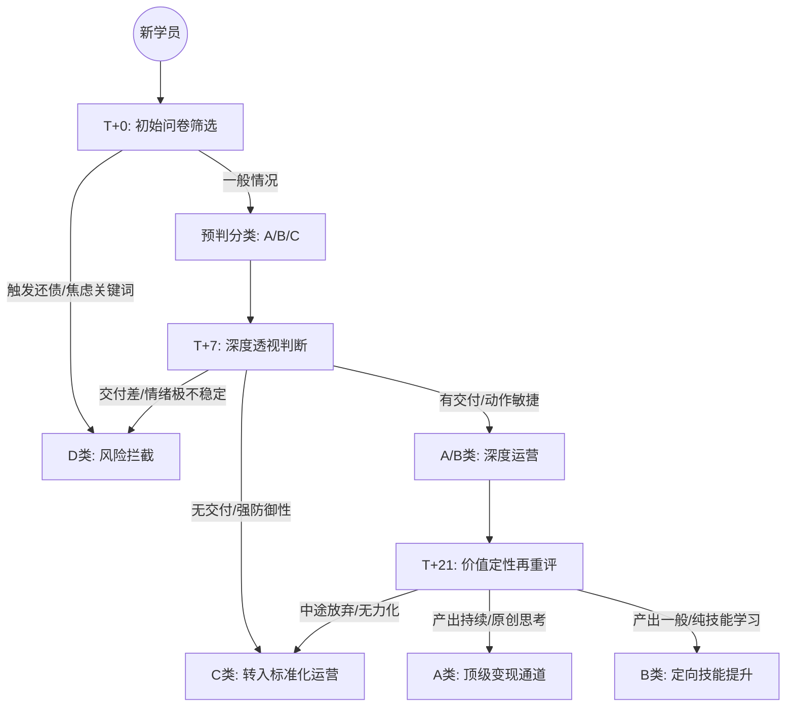

# 学员分层运营系统 - 产品需求文档 (PRD)

## 1. 文档信息
- **功能名称**：学员分类识别与差异化运营系统
- **版本**：v1.0.0
- **状态**：已发布 (草案)
- **目标 KPI**：LTV (用户终身价值) 提升，降低 D 类风险与 C 类成本

## 2. 背景与目标
目前喜播所有学员使用同一套服务体系，导致高价值 A 类用户无法获得深度服务，而高风险 D 类及情绪驱动的 C 类消耗大量运营人力。
**核心目标**：实现“分层分发”，将核心资源投入 A/B 类，拦截 D 类风险，自动化/低成本维护 C 类。

## 3. 业务流程 (Business Flow)

## 4. 功能详细说明

### 4.1. 自动化分类引擎 (Tagging Engine)
- **T+0 判定器**：根据支付前/入群前的问卷。
    - **逻辑**：匹配关键词（如：还债、救命钱、急着挣钱）。
    - **动作**：触发 D 类警告，系统自动调起客服/顾问谈话模板。
- **T+7 动态重评器**：
    - **核心数据源**：作业系统、互动频率。
    - **逻辑**：第一周核心作业未交 -> 自动降级至 C 类。
- **T+21 定性器**：依据最终 LTV 价值评估和 3 次作业的平均质量。

### 4.2. 差异化服务策略 (Service Strategy)
- **A 类服务通道**：分配专属高端导师，P0 级人工预警，优先参与线下大师课。
- **B 类培养通道**：推送专项技能练习，强调“补全意识短板”。
- **C 类自动化通道**：纯录播课 + 自动问候消息，控制人工投入。
- **D 类拦截通道**：主动发起退款谈话，拦截率指标需设为 >90%。

### 4.3. 运营看板 (Dashboard)
- 实时展示 ABCD 类用户占比饼图。
- 展示标签流转数据（例如：本周多少 B 类因为作业交付好升级为 A）。
- LTV 产出对比报表。

## 5. 验收标准 & 边界
- [ ] 场景 1：D 类用户输入“还债”关键词，系统必须在 3 秒内识别并打标。
- [ ] 场景 2：系统在第 7 天自动扫描全量学员作业进度，对未交者自动执行降级逻辑。
- [ ] 场景 3：运营人员可以根据特殊情况手动修正分类标签（需记录申请理由）。

## 6. 技术备注
- 动态标签库需支持人工自定义编辑。
- 与现有 CRM/作业管理系统需做 ID 映射关联。
- 分类逻辑需具备版本控制，防止规则库变动导致误判。
